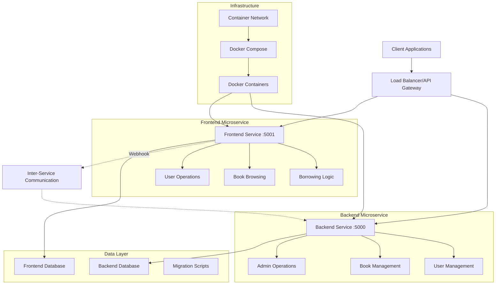
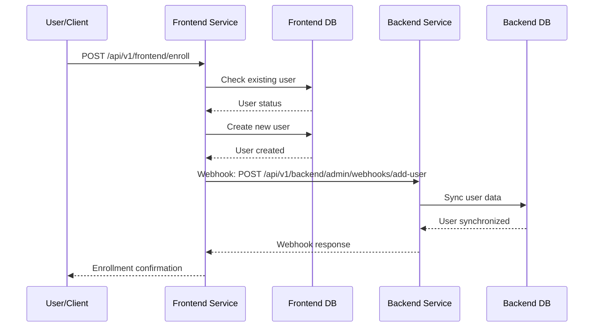
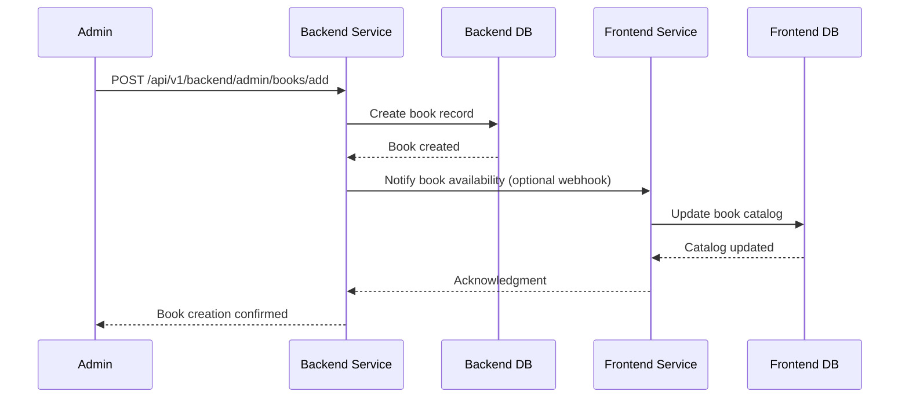
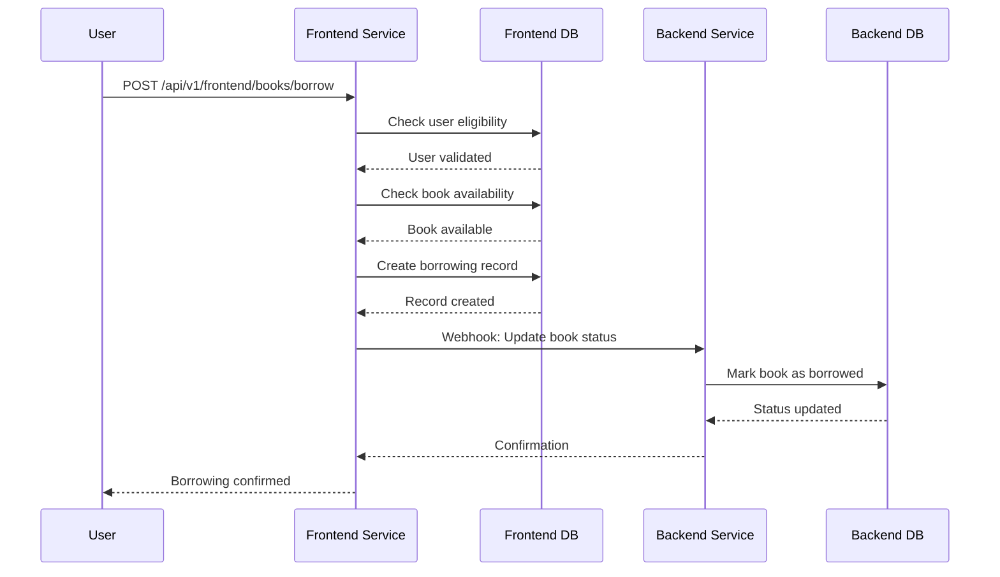

# 🏗️ System Architecture

## 📖 Overview
The Library Management System is a sophisticated microservices-based application designed for Cowrywise's backend engineering assessment. It demonstrates enterprise-grade Flask architecture with separate backend and frontend services, showcasing advanced patterns in service-oriented architecture, inter-service communication, and containerized deployment strategies.

---

## 🏛️ High-Level Architecture



The architecture employs a **microservices pattern** where each service operates independently with its own database, ensuring loose coupling and high cohesion. The services communicate through REST APIs and webhook notifications, demonstrating modern distributed system patterns.

---

## 🧩 Core Components

### Frontend Service (User-Facing Operations)
- **Purpose**: Handles all user-facing operations including enrollment, book browsing, and borrowing
- **Technology**: Flask with SQLAlchemy, running on port 5001
- **Location**: `frontend/app.py`
- **Responsibilities**:
  - User registration and enrollment
  - Book catalog browsing and search
  - Book borrowing and return operations
  - User profile and borrowed books management
  - Webhook notifications to backend service

### Backend Service (Administrative Operations)
- **Purpose**: Manages administrative functions including book inventory and user oversight
- **Technology**: Flask with SQLAlchemy, running on port 5000
- **Location**: `backend/app.py`
- **Responsibilities**:
  - Book inventory management (CRUD operations)
  - Administrative user management
  - System-wide reporting and analytics
  - Webhook endpoint handling from frontend
  - Administrative API for external integrations

### Data Models Layer
- **Purpose**: Shared domain models ensuring data consistency across services
- **Technology**: SQLAlchemy ORM with relationship mapping
- **Location**: `models/`
- **Responsibilities**:
  - User entity modeling with validation
  - Book entity modeling with availability tracking
  - Base model providing common functionality
  - Database relationship management and constraints

### API Gateway Layer
- **Purpose**: Versioned API endpoints with clear service boundaries
- **Technology**: Flask Blueprints with Swagger documentation
- **Location**: `api/v1/`
- **Responsibilities**:
  - RESTful endpoint routing and versioning
  - Request validation and response formatting
  - Interactive API documentation
  - Error handling and status code management

### Configuration Management
- **Purpose**: Environment-based configuration and cross-cutting concerns
- **Technology**: Python-dotenv with Flask configuration classes
- **Location**: `config/`
- **Responsibilities**:
  - Multi-environment configuration (dev, test, prod)
  - Database connection management
  - Logging configuration and structured output
  - Error handling and exception management

---

## 🔄 Data Flow Architecture

### User Enrollment Flow


### Book Management Flow


### Book Borrowing Flow


---

## 🗄️ Data Architecture

### Database Design Strategy

The system employs a **database-per-service** pattern, ensuring data independence and service autonomy:

#### Frontend Database Schema
```sql
-- Users table (frontend-specific)
CREATE TABLE users (
    id INTEGER PRIMARY KEY AUTOINCREMENT,
    email VARCHAR(120) UNIQUE NOT NULL,
    firstname VARCHAR(50) NOT NULL,
    lastname VARCHAR(50) NOT NULL,
    created_at DATETIME DEFAULT CURRENT_TIMESTAMP,
    updated_at DATETIME DEFAULT CURRENT_TIMESTAMP
);

-- Books table (user view)
CREATE TABLE books (
    id INTEGER PRIMARY KEY AUTOINCREMENT,
    title VARCHAR(255) NOT NULL,
    publisher VARCHAR(255) NOT NULL,
    category VARCHAR(100) NOT NULL,
    is_available BOOLEAN DEFAULT TRUE,
    borrowed_at DATETIME,
    return_by DATETIME,
    borrowed_by_id INTEGER,
    created_at DATETIME DEFAULT CURRENT_TIMESTAMP,
    updated_at DATETIME DEFAULT CURRENT_TIMESTAMP,
    FOREIGN KEY (borrowed_by_id) REFERENCES users (id)
);
```

#### Backend Database Schema
```sql
-- Users table (admin view with additional metadata)
CREATE TABLE users (
    id INTEGER PRIMARY KEY AUTOINCREMENT,
    email VARCHAR(120) UNIQUE NOT NULL,
    firstname VARCHAR(50) NOT NULL,
    lastname VARCHAR(50) NOT NULL,
    total_borrowed INTEGER DEFAULT 0,
    active_borrows INTEGER DEFAULT 0,
    created_at DATETIME DEFAULT CURRENT_TIMESTAMP,
    updated_at DATETIME DEFAULT CURRENT_TIMESTAMP
);

-- Books table (admin view with full management capabilities)
CREATE TABLE books (
    id INTEGER PRIMARY KEY AUTOINCREMENT,
    title VARCHAR(255) NOT NULL,
    publisher VARCHAR(255) NOT NULL,
    category VARCHAR(100) NOT NULL,
    is_available BOOLEAN DEFAULT TRUE,
    borrowed_at DATETIME,
    return_by DATETIME,
    borrowed_by_id INTEGER,
    times_borrowed INTEGER DEFAULT 0,
    created_at DATETIME DEFAULT CURRENT_TIMESTAMP,
    updated_at DATETIME DEFAULT CURRENT_TIMESTAMP,
    FOREIGN KEY (borrowed_by_id) REFERENCES users (id)
);
```

### Data Synchronization Strategy

1. **Event-Driven Synchronization**: Webhook-based real-time data updates
2. **Eventual Consistency**: Services may temporarily have different views
3. **Conflict Resolution**: Last-write-wins strategy with timestamp comparison
4. **Data Validation**: Cross-service validation for critical operations

---

## 🔧 Integration Points

### Inter-Service Communication Patterns

#### Synchronous Communication (REST APIs)
- **Frontend to Backend**: Webhook notifications for user enrollment
- **Backend to Frontend**: Optional inventory update notifications
- **Client to Services**: Direct API calls for immediate operations

#### Asynchronous Communication (Webhooks)
```python
# Frontend service webhook call
webhook_payload = {
    'user_id': user.id,
    'user_data': user.to_dict(),
    'timestamp': datetime.utcnow().isoformat(),
    'event_type': 'user_enrolled'
}

response = requests.post(
    'http://backend:5000/api/v1/backend/admin/webhooks/add-user',
    json=webhook_payload,
    timeout=5
)
```

### External Dependencies
- **Docker Network**: Container-to-container communication
- **Database Engines**: SQLite for development, MySQL for production
- **HTTP Client**: Requests library for inter-service calls
- **API Documentation**: Swagger/OpenAPI for interactive documentation

---

## 🛡️ Security Architecture

### Authentication & Authorization Strategy
- **Service-Level Security**: Internal API authentication between services
- **Input Validation**: Comprehensive request validation using Flask-WTF
- **SQL Injection Prevention**: Parameterized queries through SQLAlchemy ORM
- **Error Handling**: Secure error responses without information leakage

### Data Protection Measures
```python
# Input validation example
def validate_user_data(data):
    required_fields = ['email', 'firstname', 'lastname']
    missing_fields = [field for field in required_fields if not data.get(field)]
    
    if missing_fields:
        raise ValidationError(f"Missing required fields: {', '.join(missing_fields)}")
    
    if not is_valid_email(data['email']):
        raise ValidationError("Invalid email format")
    
    return True
```

### Network Security
- **Container Isolation**: Docker network isolation between services
- **Port Management**: Explicit port exposure and internal communication
- **CORS Configuration**: Cross-origin request handling for web clients

---

## 📊 Performance Considerations

### Scalability Architecture

#### Horizontal Scaling Strategy
- **Stateless Services**: Services maintain no local state for easy scaling
- **Database Connection Pooling**: Efficient database connection management
- **Load Balancing**: Ready for multiple service instances behind load balancers

#### Performance Optimization
```python
# Database connection pooling configuration
SQLALCHEMY_ENGINE_OPTIONS = {
    'pool_size': 10,
    'pool_recycle': 120,
    'pool_pre_ping': True,
    'max_overflow': 20
}
```

#### Caching Strategy
- **Application-Level Caching**: Flask-Caching for frequently accessed data
- **Database Query Optimization**: Eager loading for related data
- **Static Asset Caching**: Container-level caching for static resources

### Monitoring and Observability

#### Structured Logging
```python
# JSON logging configuration
formatter = jsonlogger.JsonFormatter(
    '%(asctime)s %(name)s %(levelname)s %(message)s'
)

# Request logging middleware
@app.before_request
def log_request_info():
    app.logger.info({
        'method': request.method,
        'url': request.url,
        'user_agent': request.headers.get('User-Agent'),
        'timestamp': datetime.utcnow().isoformat()
    })
```

#### Health Check Endpoints
- **Service Health**: `/health` endpoints for each service
- **Database Connectivity**: Health checks including database connection tests
- **Dependency Checks**: Verification of inter-service communication

---

## 🚀 Deployment Architecture

### Containerization Strategy

#### Multi-Stage Docker Build
```dockerfile
# Example Dockerfile structure
FROM python:3.9-slim as base
WORKDIR /app
COPY requirements.txt .
RUN pip install --no-cache-dir -r requirements.txt

FROM base as development
COPY . .
EXPOSE 5000
CMD ["flask", "run", "--host=0.0.0.0"]

FROM base as production
COPY . .
EXPOSE 5000
CMD ["gunicorn", "--bind", "0.0.0.0:5000", "app:app"]
```

#### Service Orchestration
```yaml
# Docker Compose configuration highlights
services:
  backend:
    build: ./backend
    ports: ["5000:5000"]
    environment:
      - FLASK_ENV=production
      - DATABASE_URL=mysql://user:pass@db/backend_db
    
  frontend:
    build: ./frontend
    ports: ["5001:5001"]
    environment:
      - FLASK_ENV=production
      - DATABASE_URL=mysql://user:pass@db/frontend_db
    
  nginx:
    image: nginx:alpine
    ports: ["80:80"]
    depends_on: [backend, frontend]
```

### Environment Management
- **Development**: SQLite databases with hot-reload enabled
- **Testing**: Isolated containers with test-specific configurations
- **Production**: MySQL databases with connection pooling and monitoring

---

## 🔮 Design Decisions & Trade-offs

### Architecture Decisions

#### Microservices vs Monolith
**Decision**: Microservices architecture with separate backend/frontend services
**Rationale**: 
- Demonstrates enterprise-scale architecture patterns
- Enables independent deployment and scaling
- Shows understanding of service boundaries and communication
- Provides better separation of concerns for assessment evaluation

**Trade-offs**:
- ✅ **Benefits**: Independent scaling, technology diversity, fault isolation
- ❌ **Costs**: Increased complexity, network latency, data consistency challenges

#### Database-per-Service Pattern
**Decision**: Separate databases for backend and frontend services
**Rationale**:
- Ensures data autonomy and service independence
- Prevents tight coupling through shared databases
- Demonstrates understanding of data ownership in microservices

**Trade-offs**:
- ✅ **Benefits**: Service autonomy, independent schema evolution
- ❌ **Costs**: Data synchronization complexity, eventual consistency

#### Webhook-based Communication
**Decision**: Asynchronous webhook notifications between services
**Rationale**:
- Demonstrates understanding of loose coupling principles
- Shows practical implementation of event-driven architecture
- Provides resilient communication patterns

**Trade-offs**:
- ✅ **Benefits**: Loose coupling, fault tolerance, extensibility
- ❌ **Costs**: Complexity in error handling, debugging challenges

### Technology Choices

#### Flask over FastAPI/Django
**Decision**: Flask framework for both services
**Rationale**:
- Lightweight and flexible for microservices
- Excellent ecosystem support (SQLAlchemy, Migrate, Testing)
- Clear separation of concerns with Blueprints
- Industry standard for API development

#### SQLAlchemy ORM
**Decision**: SQLAlchemy for data access layer
**Rationale**:
- Mature and robust ORM with excellent Flask integration
- Supports both development (SQLite) and production (MySQL) databases
- Provides migration support through Flask-Migrate
- Excellent relationship mapping and query optimization

#### Docker Containerization
**Decision**: Docker and Docker Compose for deployment
**Rationale**:
- Ensures consistent development and production environments
- Simplifies dependency management and service isolation
- Demonstrates modern DevOps practices
- Enables easy scaling and deployment strategies

---

## 🎯 Assessment Demonstration Points

### Technical Proficiency
- **Advanced Flask Patterns**: Blueprint-based architecture with proper separation
- **Database Design**: Complex relationships with proper constraint management
- **API Design**: RESTful principles with comprehensive error handling
- **Testing Strategy**: Unit and integration tests with proper mocking

### System Design Skills
- **Service Boundaries**: Clear separation of frontend and backend concerns
- **Data Modeling**: Efficient schema design with relationship optimization
- **Communication Patterns**: Webhook implementation with error handling
- **Scalability Considerations**: Stateless design ready for horizontal scaling

### DevOps and Production Readiness
- **Containerization**: Multi-service Docker setup with networking
- **Configuration Management**: Environment-based configuration with secrets
- **Logging and Monitoring**: Structured logging ready for production monitoring
- **Documentation**: Comprehensive API documentation with Swagger

### Best Practices Implementation
- **Code Organization**: Clear project structure with logical separation
- **Error Handling**: Comprehensive error handling with appropriate HTTP status codes
- **Input Validation**: Secure input handling with validation and sanitization
- **Testing Coverage**: Thorough test coverage across all service layers

---

## 🔍 Future Enhancements

### Immediate Improvements
- **Authentication & Authorization**: JWT-based user authentication
- **API Rate Limiting**: Request throttling and abuse prevention
- **Database Optimization**: Query optimization and indexing strategies
- **Monitoring Integration**: Prometheus metrics and alerting

### Advanced Features
- **Event Sourcing**: Complete audit trail of all system changes
- **CQRS Implementation**: Command-query responsibility segregation
- **Message Queue Integration**: RabbitMQ or Kafka for reliable messaging
- **Distributed Tracing**: OpenTelemetry for request tracing across services

### Production Deployment
- **Kubernetes Orchestration**: Container orchestration for cloud deployment
- **CI/CD Pipeline**: Automated testing and deployment workflows
- **Infrastructure as Code**: Terraform or CloudFormation for infrastructure
- **Blue-Green Deployment**: Zero-downtime deployment strategies
